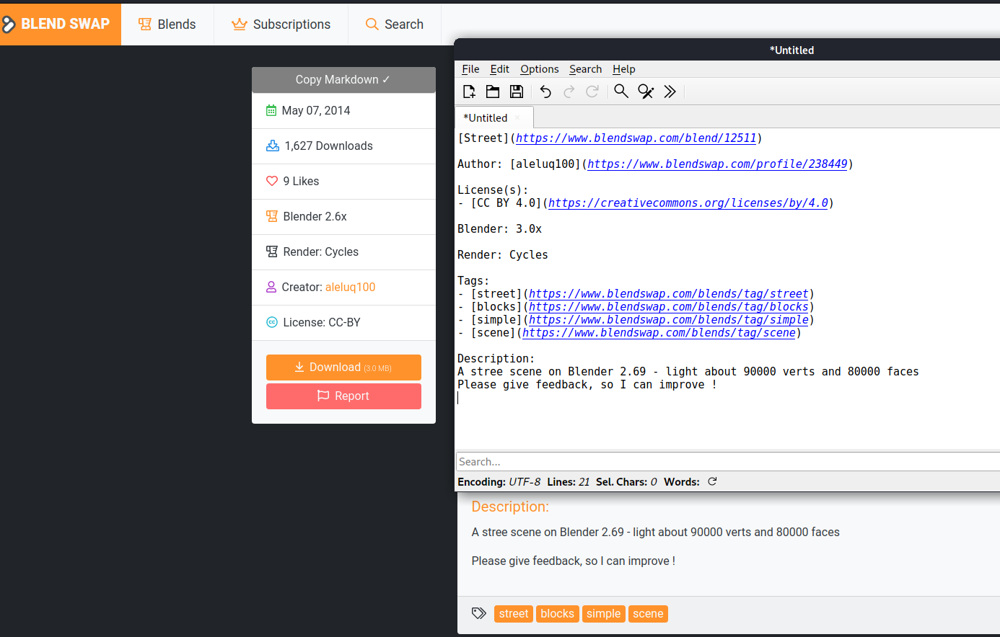

# blendSwapAttributionMaker
Copy information from a Blend Swap model page to the clipboard for easy attribution!

This script adds the "Copy Markdown" button.

After clicking the button, go to another program such as a text editor as shown then press Ctrl+V or click Edit, Paste to get the text shown in the screenshot.

*This script is not endorsed by the artist nor site in the screenshot.*

